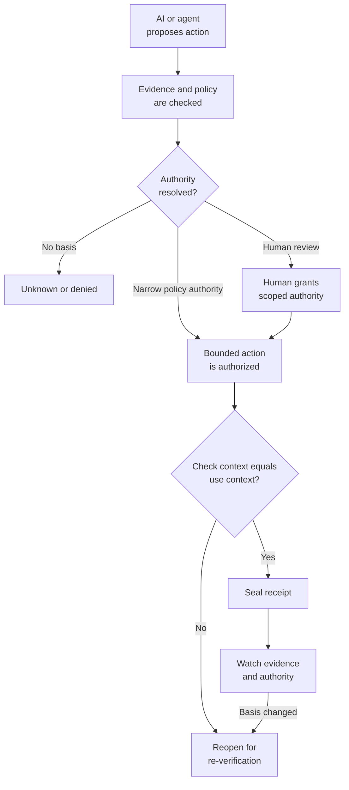

# Open Decision Receipt

**Human-in-the-loop is not evidence. A Decision Receipt is.**

```text
A trace shows what ran.
A Decision Receipt preserves why it was authorized.
Watch determines whether that basis still holds.
```

AI systems increasingly recommend, route, approve, or initiate actions that affect money, access, customers, legal outcomes, and production systems. Execution logs can show that an action happened. They rarely preserve the complete authority boundary: what evidence was checked, who or what was allowed to decide, what scope was granted, what actually executed, and whether the basis changed later.

Open Decision Receipt is a vendor-neutral schema and reference lifecycle for preserving that boundary.

## Try it in 60 seconds

```bash
git clone https://github.com/lumirosh/open-decision-receipt.git
cd open-decision-receipt
python -m pip install -e '.[dev]'
dam-verify validate examples/loan-denial-receipt.yaml
```

The validator checks YAML or JSON against the schema, names missing requirements, and reports conformance as L1 Documented, L2 Bound, or L3 Governed.

To see a previously valid decision reopen when its evidence basis changes:

```bash
bash scripts/drift-reopen-demo.sh
```

The demo verifies, approves, seals, replays, and watches one certification-gated action. It then revokes the certificate and shows why the old approval no longer holds.

## The proof object

```yaml
decision_id: DR-2026-07-10-loan001
workflow: loan_underwriting_ai
decision_type: deny_loan_application
risk_class: high

check:
  checked_by: loan_officer_r.chen
  evidence_seen:
    - application_LN-88213
    - credit_score_report_v2
    - lending_policy_v4_section_7.2
  context_hash_at_check: "sha256:7ab2..."

authority:
  approver: lending_manager_m.ortiz
  authority_basis: lending_authority_matrix_v4#L2
  approval_scope: "deny loan application LN-88213"

execution:
  actual_action: "denial notice issued with reason code 7.2-DTI"
  context_hash_at_execution: "sha256:7ab2..."

accountability:
  accountable_owner: lending_manager_m.ortiz
```

See the [complete loan receipt](./examples/loan-denial-receipt.yaml).

## Lifecycle



The lifecycle is fail-closed:

- unknown authority or missing evidence does not become approval
- changed context blocks sealing
- later evidence or authority drift reopens a sealed receipt
- promotion into reusable verified knowledge remains a separate human gate

Read the complete [lifecycle](./docs/lifecycle.md) and [limitations](./docs/limitations.md).

## More ways to run it

### Run a human-gated application

```bash
python -m venv .venv-adk
.venv-adk/bin/python -m pip install -e '.[adk,dev]'

.venv-adk/bin/adk run integrations/google_adk/loan_denial
# or
.venv-adk/bin/adk run integrations/google_adk/soc_analyst_containment
```

The two synthetic [Google ADK workflows](./integrations/google_adk/README.md) pause for human review, perform only local mock actions, and produce sealed Decision Receipts. Google ADK is an optional orchestration adapter; the receipt core remains vendor-neutral.

## Choose your path

| If you are a... | Start here |
|---|---|
| Agent or platform engineer | [Quickstart](./docs/quickstart.md) and [Google ADK workflows](./integrations/google_adk/README.md) |
| Security architect | [Security mappings](./docs/mappings/security.md) and [SOC containment](./docs/case-study-soc-containment.md) |
| Governance or risk practitioner | [Governance mappings](./docs/mappings/governance.md), [loan denial](./docs/case-study-loan-denial.md), and [limitations](./docs/limitations.md) |
| Standards or provenance researcher | [Provenance lineage](./docs/mappings/provenance.md), [architecture](./docs/architecture.md), and [future directions](./docs/future-directions.md) |
| MCP implementer | [MCP verified-action bridge](./docs/mcp-verified-action-bridge.md) |

## Example patterns

Examples are included to demonstrate different authority and evidence failures, not to claim production readiness in each industry.

| Example | Pattern demonstrated |
|---|---|
| [Loan denial](./docs/case-study-loan-denial.md) | Model recommendation, independent evidence review, human authority, bounded execution |
| [Analyst-gated SOC containment](./integrations/google_adk/README.md#soc-analyst-gated-containment) | Urgent but reversible action held for human review |
| [Policy-authorized SOC containment](./docs/case-study-soc-containment.md) | Narrow autonomy, accountable owner, watch and reopen on drift |
| [Claim payout](./examples/claim-payout-receipt.yaml) | Check-time and use-time context mismatch, related to CWE-367 |
| [Hallucinated legal precedent](./docs/case-study-ai-hallucinated-precedent.md) | Unsupported evidence blocks authority |
| [Certification-gated deployment](./docs/quickstart.md) | Previously valid authority becomes stale and requires re-verification |

## Conformance

| Level | Meaning |
|---|---|
| **L1: Documented** | Required fields are present and schema-valid |
| **L2: Bound** | Check-time and use-time context are recorded and linked |
| **L3: Governed** | The receipt is lifecycle-managed, seals only on a valid basis, and reopens on drift |

Most workflows should reach L2. High-consequence workflows should target L3. See the detailed [conformance levels](./docs/mappings/conformance.md).

## Boundaries

This project is:

- an open receipt format
- a minimal reference lifecycle
- a set of executable examples and adapters
- an interoperability proposal for decision provenance

It is not:

- a runtime enforcement engine
- an IAM or credential system
- a GRC suite
- a signature or identity-verification scheme
- a legal opinion or compliance certification

A receipt can make a decision inspectable. It cannot make bad evidence true or replace the systems that authenticate identity, evaluate policy, enforce access, or perform the action.

## Documentation

| Need | Document |
|---|---|
| Browse all documentation paths | [Documentation index](./docs/README.md) |
| Install and run the lifecycle | [Quickstart](./docs/quickstart.md) |
| Understand components and boundaries | [Architecture](./docs/architecture.md) |
| Understand states and lifecycle verbs | [Lifecycle](./docs/lifecycle.md) |
| Review security weakness classes | [Security mappings](./docs/mappings/security.md) |
| Review governance framework questions | [Governance mappings](./docs/mappings/governance.md) |
| Review conformance behavior | [Conformance levels](./docs/mappings/conformance.md) |
| Review provenance and conceptual lineage | [Provenance lineage](./docs/mappings/provenance.md) |
| Understand current limitations | [Limitations](./docs/limitations.md) |
| Understand the MCP integration boundary | [MCP verified-action bridge](./docs/mcp-verified-action-bridge.md) |
| Review proposed structured-query evidence | [Future directions](./docs/future-directions.md) |
| Read the longer project thesis | [Decision Receipt Manifesto](./DECISION-RECEIPT-MANIFESTO.md) |

## Contributing

Contributions should make consequential AI-enabled actions more evidenced, bounded, accountable, and replayable. Good contributions add a distinct governance pattern, map receipt fields to a named weakness class, strengthen the lifecycle, or add an adapter without bypassing its authority boundary.

See [CONTRIBUTING.md](./CONTRIBUTING.md) and [SECURITY.md](./SECURITY.md).

## License

Apache-2.0. Maintained by [LumiRosh Research](https://lumirosh.com).
