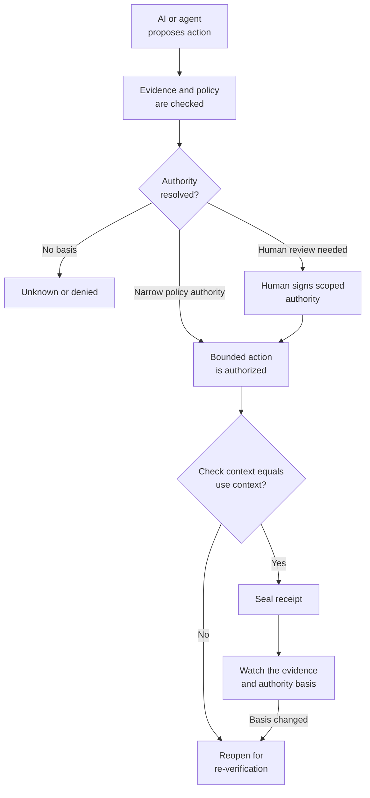

# Open Decision Receipt

**A small, open reference for proving that an AI-enabled action was authorized, bounded, and still valid when it ran.**

A Decision Receipt is a portable record of the evidence, authority, scope, execution, and accountable owner around a consequential action.

It is for teams building AI-assisted workflows that can approve, deny, deploy, restrict, pay, or isolate.

```text
A log records that an action happened.
A Decision Receipt records why that action was allowed.
```

## The lifecycle



The point is not to add another audit log. It is to preserve a decision's authority boundary across time.

## What it answers

| Question | Receipt evidence |
|---|---|
| Who requested the action and under what authority? | `request` |
| What was checked before it ran? | `check` |
| Who approved the exact scope? | `authority` |
| What was allowed, denied, and actually executed? | `boundary`, `execution` |
| Did the checked context still hold at execution? | check-time and execution-time hashes |
| What happens when the basis changes later? | `watch()` reopens the receipt |

## See it work

| Start here | What it demonstrates |
|---|---|
| [Quickstart](./docs/quickstart.md) | Verify, approve, seal, replay, and watch one high-risk action locally. |
| [Loan denial](./docs/case-study-loan-denial.md) | Model recommendation, human review, manager authority, and bounded execution. |
| [SOC containment](./docs/case-study-soc-containment.md) | A narrow policy-authorized isolation reopens when threat intelligence is retracted. |
| [Architecture](./docs/architecture.md) | Roles, lifecycle, and the MCP verified-action boundary. |

## Quickstart

```bash
git clone https://github.com/lumirosh/open-decision-receipt.git
cd open-decision-receipt
python -m pip install -e '.[dev]'
python -m pytest -q

rm -rf /tmp/odr-receipts
dam-verify --receipts-dir /tmp/odr-receipts verify examples/verify-action-deploy.json
# copy the decision_id from the output

dam-verify --receipts-dir /tmp/odr-receipts approve <decision_id> --approver operator
dam-verify --receipts-dir /tmp/odr-receipts seal <decision_id>
dam-verify --receipts-dir /tmp/odr-receipts replay <decision_id>
```

Expected replay signal:

```text
check==use : True
chain intact: True
```

## Design position

```text
MCP says what an agent can call.
A Decision Receipt records what the agent was authorized to do,
which evidence supported it, and whether that basis still holds.
```

The reference implementation is intentionally small:

- authority bundles and receipts are local files
- unknown authority and missing evidence fail closed
- a changed check-time context refuses sealing
- a later evidence-basis change reopens a sealed receipt
- promotion into verified knowledge stays human-approved

## What this is not

This repository is not a runtime enforcement engine, IAM system, GRC suite, signature scheme, legal opinion, or compliance certification.

A receipt can make a decision inspectable. It cannot make bad evidence true or replace the controls that enforce an action.

Read the full [limitations](./docs/limitations.md).

## Deep dive

| Need | Document |
|---|---|
| Understand states and lifecycle verbs | [Lifecycle](./docs/lifecycle.md) |
| Map receipt fields to security and governance weaknesses | [Reference mappings](./docs/reference-mappings.md) |
| Understand the MCP integration boundary | [MCP verified-action bridge](./docs/mcp-verified-action-bridge.md) |
| Review structured-query evidence direction | [Future directions](./docs/future-directions.md) |
| Read the longer thesis behind the project | [Decision Receipt Manifesto](./DECISION-RECEIPT-MANIFESTO.md) |
| Review the minimal human-readable shape | [Minimum schema](./decision-receipt.schema.yaml) |

## Contributing

Contributions should make consequential AI-enabled actions more evidenced, bounded, accountable, and replayable. Good contributions add a real workflow example, map fields to a named weakness class, or strengthen the lifecycle without bypassing the human gate.

See [CONTRIBUTING.md](./CONTRIBUTING.md) and [SECURITY.md](./SECURITY.md).

## License

Apache-2.0. Maintained by [LumiRosh Research](https://lumirosh.com).
