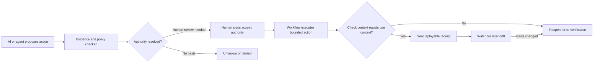

# The Open Decision Receipt Schema

**Human-in-the-loop is not evidence. A Decision Receipt is.**

An open, vendor-neutral schema and reference implementation for proving that AI-enabled decisions were **authorized, evidenced, bounded, executed as approved, accountable, and replayable**.

For AI governance, security, GRC, platform, and agent-infra teams who need to prove why an AI-assisted action was authorized, not just log that it happened.

A Decision Receipt is not just an audit log. It is an authority object with a lifecycle:

```text
issued before → enforced during → sealed after → reopened when the basis changes
```

## In 30 seconds



**See it in one high-risk workflow:** [`AI-assisted loan denial`](./docs/case-study-loan-denial.md) shows model recommendation → human evidence review → manager approval → bounded execution → later replay.

Architecture, MCP boundary, and documentation map: [`docs/architecture.md`](./docs/architecture.md).

---

## Quickstart

```bash
git clone https://github.com/lumirosh/open-decision-receipt.git
cd open-decision-receipt
python -m pip install -e '.[dev]'
python -m pytest -q

rm -rf /tmp/odr-receipts

dam-verify --receipts-dir /tmp/odr-receipts verify examples/verify-action-deploy.json
# copy the decision_id from the output

dam-verify --receipts-dir /tmp/odr-receipts approve <decision_id> --approver operator
dam-verify --receipts-dir /tmp/odr-receipts seal <decision_id>
dam-verify --receipts-dir /tmp/odr-receipts replay <decision_id>
dam-verify --receipts-dir /tmp/odr-receipts chain
```

Expected replay signal:

```text
check==use : True
chain intact: True
```

Full walkthrough: [`docs/quickstart.md`](./docs/quickstart.md).

---

## The wound

AI is making decisions faster than organizations can prove who had authority to make them.

The uncomfortable failure mode is not only that an AI system gives a bad answer. It is that a human becomes accountable for an AI-assisted action without having clear, scoped, provable authority over it.

That is compliance theatre:

```text
AI recommends.
Human clicks approve.
System executes.
Nobody can prove what authority was checked, what evidence was visible, what changed, or why the action was allowed.
```

The Decision Receipt exists to close that gap.

---

## The problem

AI is not mainly creating new security classes. It is resurfacing old failures inside faster, less visible business workflows: the human approves one context while the system executes another, tool access exceeds decision authority, or nobody can reconstruct why the action was allowed.

The Receipt binds **check-time to use-time**. It records what was checked, who had authority, what action was permitted, what actually executed, and whether the evidence or authority basis later changed.

For the full weakness-class and regulatory crosswalk, see [`docs/reference-mappings.md`](./docs/reference-mappings.md).

---

## The missing artifact

When an AI-assisted decision goes wrong, organizations discover they have **fragments**: a Slack message, a workflow log, a model output, a dashboard screenshot.

They do not have a **decision object**.

A log says:

> something happened.

A Decision Receipt says:

> this happened because this authority approved this bounded action, using this evidence, under this policy, at this time, with this access path, this execution boundary, and this accountable owner.

| Audit log | Decision Receipt |
|---|---|
| Records events | Records judgment |
| System-centered | Authority-centered |
| Shows what happened | Shows why it was allowed |
| Timestamp only | Check-time and use-time |
| Good for debugging | Good for accountability |

The receipt binds **check-time to use-time**. Every receipt carries `checked_at` / `executed_at` and `context_hash_at_check` / `context_hash_at_execution`. If the hashes differ, you have found a TOCTOU gap between what the human approved and what the machine did.

---

## The lifecycle

The schema is the shape. The lifecycle is the system.

```text
DRAFT
  ↓
VERIFY ACTION
  ↓
NEEDS HUMAN REVIEW / DENIED / UNKNOWN / AUTHORIZED
  ↓
HUMAN APPROVES SCOPED AUTHORITY
  ↓
AUTHORIZED
  ↓
ACTION EXECUTES
  ↓
SEAL
  ↓
SEALED or REOPENED
  ↓
WATCH
  ↓
REOPENED if the authority or evidence basis changes
  ↓
PROMOTE
  ↓
verified OKF/DAM knowledge, only after explicit human approval
```

The four tenses:

| Tense | The receipt is | What it proves |
|---|---|---|
| Before | Authorization | Authority, evidence, allowed actions, denied actions, approval scope |
| During | Boundary | What may execute, under which credential, with fail-closed behavior |
| After | Evidence | What executed, whether check-time matched use-time, whether the receipt is replayable |
| Over time | Sensor | Whether a sealed receipt must reopen because the basis changed |

This is the philosophical shift:

> Human-in-the-loop means human presence. A Decision Receipt means human authorship.

The human does not merely sit in the loop. The human signs scoped authority into the object.

---

## The schema

The minimum human-readable schema is in [`decision-receipt.schema.yaml`](./decision-receipt.schema.yaml). Machine-valid JSON Schemas live in [`schemas/`](./schemas/):

```text
schemas/decision-receipt.schema.json
schemas/action-request.schema.json
```

Worked examples are in [`examples/`](./examples/). The test suite validates the examples against the machine schemas.

Start with the visual producer-to-consumer walkthrough: [`docs/case-study-loan-denial.md`](./docs/case-study-loan-denial.md).

Eight blocks:

```text
request         who asked, with what authority
check           what was verified, when, against what evidence
recommendation  what the model/human suggested, and dissenting signals
authority       who approved, on what basis, within what scope
execution       what actually ran, with which credential, against which state
boundary        allowed vs denied actions; fail-open or fail-closed
accountability  who owns the consequence; escalation path
receipt         replayability: prompt, output, run IDs, integrity hash
```

Each field exists to expose a specific weakness class:

| Weakness | Receipt field that exposes it |
|---|---|
| TOCTOU (CWE-367) | `checked_at` vs `executed_at`, context hashes |
| Confused deputy (CWE-441) | `requester_authority` vs `credential_used` |
| Broken authorization | `approval_scope`, `allowed_actions` / `denied_actions` |
| Privilege drift | `credential_used`, `tool_or_system` |
| Fail-open | `boundary.failure_mode` |
| Repudiation | `receipt.*` IDs, `integrity_hash`, `replayable` |
| SoD failure | distinct `recommended_by` / `approver` / `executed_by` |
| Missing revocation | `authority_basis`, approval timestamps vs policy version |

---

## DAM: the lifecycle engine

DAM is the reference lifecycle around the schema.

```text
OKF bundle       authority source: policy, workflow, runbook, evidence basis
Action request   actor + workflow + requested action + risk + evidence refs
verify_action    checks authority and evidence before action
approve          human signs scoped authority
seal             proves check-time matched use-time, or reopens
watch            reopens sealed receipts when their basis drifts
promote          turns sealed receipts into verified OKF/DAM knowledge
```

Compressed:

> OKF is what the action is checked against. DAM is the engine that moves the decision through its lifecycle. The Decision Receipt is the portable proof object.

---

## Reference command flow

The current reference CLI is intentionally small and boring.

```bash
# 1. Verify a proposed action against an authority bundle
python -m dam_verify.cli verify examples/verify-action-deploy.json
# or, after install: dam-verify verify examples/verify-action-deploy.json

# 2. Human signs scoped authority
python -m dam_verify.cli approve <decision_id> --approver operator

# 3. Seal after execution
python -m dam_verify.cli seal <decision_id>

# 4. Render the receipt story and verify the hash chain
python -m dam_verify.cli replay <decision_id>
python -m dam_verify.cli chain

# 5. Compile the receipt authority boundary into a JSON Schema
python -m dam_verify.cli grammar <decision_id>

# 6. Watch sealed receipts for basis drift
python -m dam_verify.cli watch

# 7. Dry-run promotion into OKF/DAM verified knowledge
python -m dam_verify.cli promote <decision_id>

# 8. Explicitly promote after human approval
python -m dam_verify.cli promote <decision_id> --approve
```

The demo story:

```text
T0: cert is valid
T1: action verifies and requires human review
T2: human approves scoped authority
T3: action seals because check-time equals use-time
T4: cert is revoked
T5: watcher reopens the sealed receipt
```

One-line demo:

> Same actor, same action, same workflow. Valid yesterday, blocked today, and the receipt explains why.

---

## Reference implementation layout

```text
dam_verify/receipt.py      Receipt object, lifecycle states, hashing
dam_verify/engine.py       BundleStore, ReceiptStore, verify_action, approve, seal, watch
dam_verify/chain.py        tamper-evident hash chain for sealed receipts
dam_verify/grammar.py      compile authorized/sealed receipt boundaries into JSON Schema
dam_verify/okf.py          promote sealed receipt into OKF/DAM bundle
dam_verify/cli.py          CLI for verify/approve/seal/watch/show/replay/grammar/chain/promote

schemas/                   machine-valid JSON Schemas
dam/action_bundles/        OKF-style authority bundles
examples/                  receipt and action-request examples
docs/                      quickstart, lifecycle, MCP bridge, limitations
tests/                     lifecycle, schema, chain, grammar, replay, and promotion tests
```

Core functions:

```python
verify_action(request, bundles)  # before
authorize = approve(receipt, approver)
seal(receipt, execution_record, bundles)  # after
watch(receipt_store, bundles)  # over time
promote_receipt_bundle(receipt, approve=True)  # verified knowledge
```

Current test gate:

```bash
python -m pytest -q
```

The standalone package test count is intentionally small; the parent LumiRosh repository runs the larger integration gate.

---

## Reference mappings

The receipt maps its fields to familiar security and governance questions: TOCTOU, confused deputy, broken authorization, fail-open behavior, separation of duties, and replayability.

See [`docs/reference-mappings.md`](./docs/reference-mappings.md) for the full security crosswalk, regulatory mapping, and fourteen workflow diagnostic questions.

---

## Design invariant

```text
No consequential AI-enabled action should happen without replayable proof of
evidence, authority, scope, execution, and accountability.
```

---

## What this deliberately is not

This is not:

- an agent framework
- a runtime enforcement engine
- a GRC suite
- a UI
- a policy language
- identity binding
- a signature scheme
- legal advice

It is the missing authority and evidence object. Enforcement layers can consume it. Governance teams can inspect it. Auditors can replay it. Humans can sign it.

For the honest boundary list, see [`docs/limitations.md`](./docs/limitations.md).

---

## Contributing

Issues and PRs welcome. See [CONTRIBUTING.md](./CONTRIBUTING.md). Good contributions map fields to named weakness classes, add worked examples from real workflow types, improve regulatory mappings with primary-source references, or strengthen the reference lifecycle without bypassing the human gate.

Unverifiable incident claims will not be merged; every example needs a reproducible or primary-sourced basis.

## License

Apache-2.0. Use it, implement it, ship it.

---

*Maintained by [LumiRosh Research](https://lumirosh.com). To see how this schema maps to your workflows: [lumirosh.com](https://lumirosh.com).*
