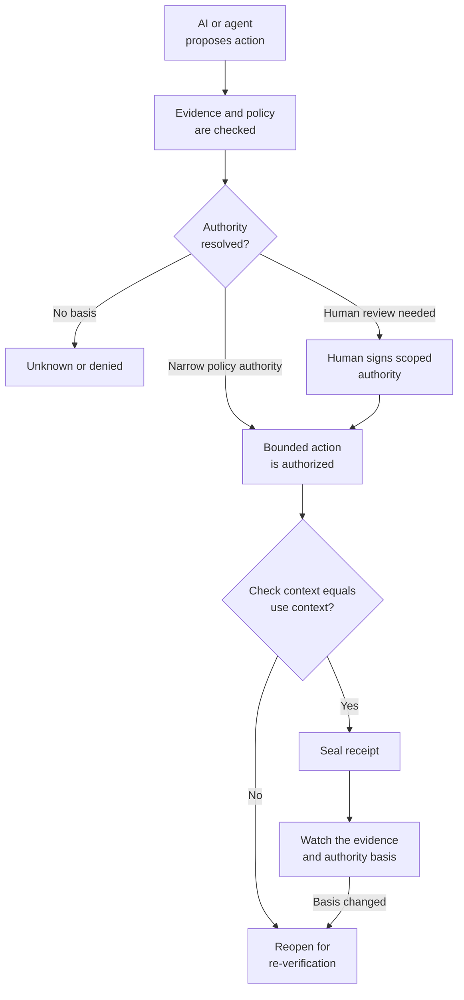

# Open Decision Receipt

**A small, open reference for proving that an AI-enabled action was authorized, bounded, and still valid when it ran.**

```text
A log records that an action happened.
A Decision Receipt records why that action was allowed.
```

## Validate your receipt in 30 seconds

```bash
git clone https://github.com/lumirosh/open-decision-receipt.git
cd open-decision-receipt
python -m pip install -e '.[dev]'

# Check your own receipt against the schema
dam-verify validate examples/loan-denial-receipt.yaml
```

That single command checks whether a receipt is well-formed and tells you its conformance level.

Works with any YAML or JSON file that follows the [Decision Receipt schema](./decision-receipt.schema.yaml).

## Conformance levels

| Level | Name | What it proves | Validate it with |
|---|---|---|---|
| **L1** | Documented | Required fields present, schema-valid | `dam-verify validate <receipt>` |
| **L2** | Bound | Check-time and use-time hashes recorded | L1 + `dam-verify chain` |
| **L3** | Governed | Lifecycle-managed: seals on check/use match, reopens on drift | L2 + `dam-verify watch` |

Most workflows should reach L2. Regulated, high-consequence decisions should target L3, where the receipt reopens automatically when its evidence or authority basis changes.

## The lifecycle



The point is not another audit log. It is a decision's authority boundary preserved across time.

## See it work

```bash
# Full lifecycle: verify, approve, seal, replay, watch
bash scripts/drift-reopen-demo.sh
```

This runs the same demo in 60 seconds: a certification-gated deployment is verified, approved, sealed, then reopened when the certificate is revoked.

For a narrated walkthrough with real workflow scenarios:

| Start here | What it demonstrates |
|---|---|
| [Loan denial](./docs/case-study-loan-denial.md) | Model recommendation, human evidence review, manager authority, bounded execution. |
| [SOC containment](./docs/case-study-soc-containment.md) | A narrow policy-authorized host isolation reopens when the threat intelligence is retracted. |
| [Google ADK workflows](./integrations/google_adk/README.md) | Run separate human-gated loan and SOC application workflows that produce sealed receipts. |
| [Quickstart](./docs/quickstart.md) | Step-by-step: verify, approve, seal, replay, and watch one high-risk action locally. |

## Design position

```text
MCP says what an agent can call.
A Decision Receipt records what the agent was authorized to do,
which evidence supported it, and whether that basis still holds.
```

The reference implementation is intentionally small:

- authority bundles and receipts are local files
- unknown authority and missing evidence fail closed
- a changed check-time context refuses sealing
- a later evidence-basis change reopens a sealed receipt
- promotion into verified knowledge stays human-approved

## What this is not

This repository is not a runtime enforcement engine, IAM system, GRC suite, signature scheme, legal opinion, or compliance certification.

A receipt can make a decision inspectable. It cannot make bad evidence true or replace the controls that enforce an action.

Read the full [limitations](./docs/limitations.md).

## Deep dive

| Need | Document |
|---|---|
| Understand states and lifecycle verbs | [Lifecycle](./docs/lifecycle.md) |
| Map receipt fields to security and governance weaknesses | [Reference mappings](./docs/reference-mappings.md) |
| Review conformance levels and conceptual lineage | [Reference mappings](./docs/reference-mappings.md) |
| Understand the MCP integration boundary | [MCP verified-action bridge](./docs/mcp-verified-action-bridge.md) |
| Review structured-query evidence direction | [Future directions](./docs/future-directions.md) |
| Read the longer thesis behind the project | [Decision Receipt Manifesto](./DECISION-RECEIPT-MANIFESTO.md) |
| Review the minimal human-readable shape | [Minimum schema](./decision-receipt.schema.yaml) |

## Contributing

Contributions should make consequential AI-enabled actions more evidenced, bounded, accountable, and replayable. Good contributions add a real workflow example, map fields to a named weakness class, or strengthen the lifecycle without bypassing the human gate.

See [CONTRIBUTING.md](./CONTRIBUTING.md) and [SECURITY.md](./SECURITY.md).

## License

Apache-2.0. Maintained by [LumiRosh Research](https://lumirosh.com).
