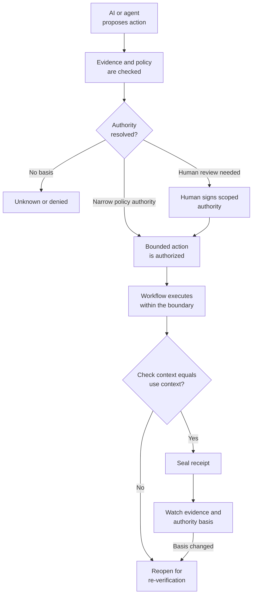
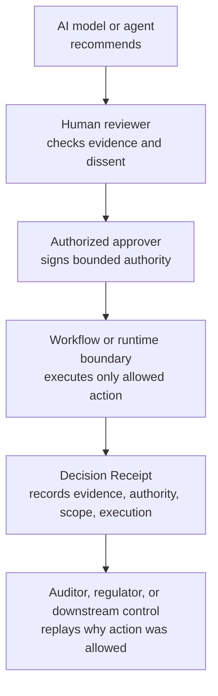
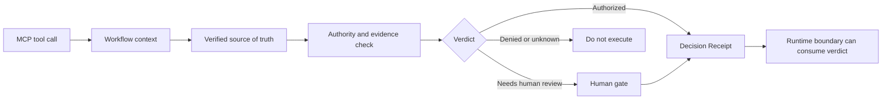

# Open Decision Receipt Architecture

A Decision Receipt is the portable authority and evidence object around a consequential AI-enabled action. It does not replace a runtime control. It makes the basis for an allow, block, or escalation inspectable and replayable.

## 30-second flow



## Who does what



The receipt preserves separation of duties when recommendation, review, approval, and execution are distinct roles.

## Lifecycle and boundary

```text
Before action:  verify evidence, policy, requester authority, and scope.
During action:  enforce the approved boundary in the workflow or runtime layer.
After action:   seal when check-time and execution-time context match.
Over time:      watch for evidence or authority drift and reopen when needed.
Later:          replay the receipt to reconstruct why the action was allowed.
```

## MCP and verified action



MCP describes what an agent can call. A Decision Receipt describes what the agent can justify. For implementation detail, see [`mcp-verified-action-bridge.md`](./mcp-verified-action-bridge.md).

## Worked example

See the full producer-to-consumer flow in [`case-study-loan-denial.md`](./case-study-loan-denial.md):

```text
model recommendation
→ human evidence review
→ manager approval
→ bounded workflow execution
→ replay six months later
```

## Documentation map

| Need | Document |
|---|---|
| See one high-risk decision end to end | [`case-study-loan-denial.md`](./case-study-loan-denial.md) |
| See policy-authorized containment reopen on evidence drift | [`case-study-soc-containment.md`](./case-study-soc-containment.md) |
| Understand object states and lifecycle verbs | [`lifecycle.md`](./lifecycle.md) |
| Connect receipts to MCP tool-use boundaries | [`mcp-verified-action-bridge.md`](./mcp-verified-action-bridge.md) |
| Review weakness classes | [`mappings/security.md`](./mappings/security.md) |
| Review governance questions | [`mappings/governance.md`](./mappings/governance.md) |
| Review conformance behavior | [`mappings/conformance.md`](./mappings/conformance.md) |
| Review conceptual lineage | [`mappings/provenance.md`](./mappings/provenance.md) |
| Run the reference CLI | [`quickstart.md`](./quickstart.md) |
| Review structured-query evidence direction | [`future-directions.md`](./future-directions.md) |
| Understand explicit non-claims | [`limitations.md`](./limitations.md) |
