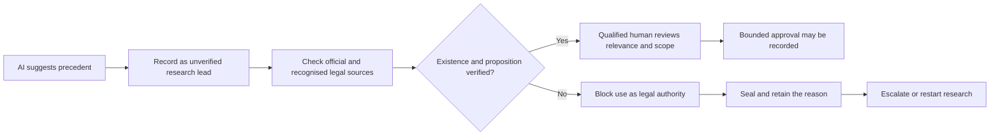

# Case Study: Blocking an Unverified AI-Suggested Precedent

> An AI research tool suggests a case that appears to support a legal proposition. The case cannot be found in an official judgment repository or recognised legal database. The workflow blocks it before it enters a pleading or adjudicatory determination.

Source object: [`../examples/legal-ai-precedent-blocked-receipt.yaml`](../examples/legal-ai-precedent-blocked-receipt.yaml).

## Public basis

This worked example is derived from the control failure examined by the Supreme Court of India in *Pooja Ramesh Singh v. Jammu and Kashmir Bank Ltd. & Anr.*, 2026 INSC 668, Civil Appeal No. 11950 of 2025, decided 2 July 2026.

The Court set aside NCLT and NCLAT decisions after the tribunal relied on non-existent, fake, AI-generated material as precedent. It required zero tolerance for using AI-generated precedents without verification and held that adjudication must remain under human control at every stage.

Primary source: [Supreme Court judgment, 2026 INSC 668](https://api.sci.gov.in/supremecourt/2025/52338/52338_2025_5_1501_71939_Judgement_02-Jul-2026.pdf).

## The decision being receipted

The receipt does not attempt to receipt the whole judicial determination. It captures the narrower, prior authority decision:

> May this proposed precedent enter a pleading, submission, legal opinion, order, or judgment as verified legal authority?

That boundary is where an AI research lead can either remain a lead or acquire institutional authority.

## Control flow



## What the receipt contributes

| Failure question | Receipt field |
|---|---|
| Where did the proposed authority come from? | `request`, `recommendation` |
| What sources were checked? | `check.evidence_seen` |
| What could not be established? | `check.dissenting_signals` |
| Who had authority to admit or reject it? | `authority`, `accountability` |
| What was the permitted scope? | `authority.approval_scope`, `boundary` |
| Did uncertainty silently become approval? | `boundary.failure_mode: fail_closed` |
| What actually happened? | `execution.execution_result: blocked_unverified_authority` |

## Why human-in-the-loop is insufficient

A human may be present and still accept a plausible citation without checking it. The receipt requires the human gate to become inspectable:

```text
AI output -> named verification -> authoritative source -> scoped approval -> legal use
```

If authoritative verification fails:

```text
AI output -> named verification -> no primary source -> blocked and escalated
```

## What this example does not claim

- The Supreme Court endorsed Decision Receipts.
- A Decision Receipt existed in the underlying proceedings.
- The public record identifies a specific AI product or complete generation path.
- A receipt alone determines whether a legal proposition is correct or applicable.
- This repository provides legal advice or substitutes for professional judgment.

The narrower claim is operational: a replayable evidence and authority gate makes it harder for an unverified research lead to silently become consequential legal authority.
