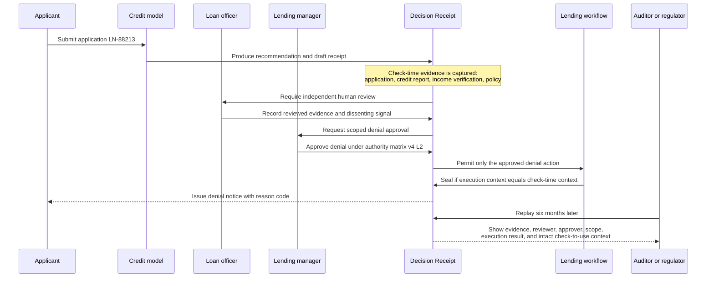

# Case Study: AI-Assisted Loan Denial

Illustrative only. This worked example shows how a high-risk credit decision can remain replayable without treating a human click as sufficient evidence.

Source object: [`../examples/loan-denial-receipt.yaml`](../examples/loan-denial-receipt.yaml).

## The scenario

A credit-scoring model recommends denial for an application. A loan officer reviews the evidence. A lending manager, who has delegated authority for this risk class, approves the bounded denial. The workflow issues the notice only when the execution context still matches the reviewed context.

Without a receipt, a later reviewer may find fragments: a model output, an approval click, and a denial notice. They cannot reliably establish what the reviewer saw, who had authority, or whether the application changed before the notice was issued.

## Producer and consumer flow



## What the receipt proves

| Question | Receipt evidence |
|---|---|
| What did the AI recommend? | `recommendation` block, model version, confidence, rationale |
| What did the human actually check? | `check.evidence_seen`, assumptions, and dissenting signals |
| Who had authority to approve denial? | `authority.approver`, `authority_basis`, and approval scope |
| Was separation of duties preserved? | Model recommends, officer reviews, manager approves, workflow executes |
| What did the system execute? | `execution.actual_action`, system, credential, result |
| Did anything change before execution? | `context_hash_at_check` equals `context_hash_at_execution` |
| Who owns the consequence and appeal route? | `accountability` block |

## Why this is different from human presence

```text
Human-in-the-loop: a person clicked approval.

Decision Receipt: a named authority approved one bounded action after a
separate reviewer recorded evidence, and the workflow proved it executed
against the same context.
```

## Compare the worked examples

- [`loan-denial-receipt.yaml`](../examples/loan-denial-receipt.yaml): working-as-intended, replayable high-risk denial.
- [`claim-payout-receipt.yaml`](../examples/claim-payout-receipt.yaml): detects a context change between check and use.
- [`gift-card-fraud-no-receipt.yaml`](../examples/gift-card-fraud-no-receipt.yaml): shows the failure mode when no receipt exists.
