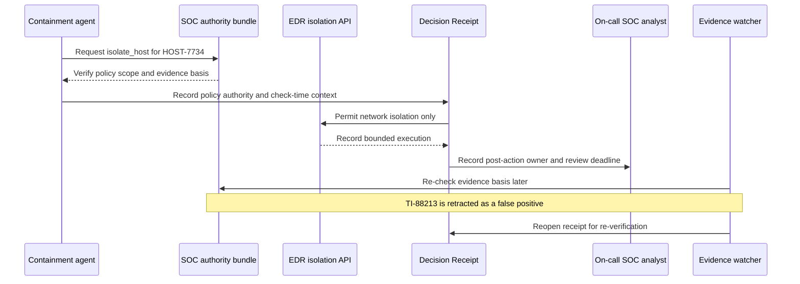

# Case Study: Policy-Authorized SOC Containment

> At 02:14 a containment agent isolates a host under a pre-approved runbook. The next morning, the threat intelligence feed retracts the original indicator as a false positive. A SOC lead must determine whether the isolation is still justified without waiting for the original incident responders to come on shift.

Illustrative only. This scenario demonstrates a narrow, reversible response that is pre-authorized by policy and remains replayable when its authorizing evidence later changes.

Source objects:

- [`../examples/verify-action-soc-containment.json`](../examples/verify-action-soc-containment.json)
- [`../examples/incident-response-containment-receipt.yaml`](../examples/incident-response-containment-receipt.yaml)
- [`../dam/action_bundles/soc_automated_containment.yaml`](../dam/action_bundles/soc_automated_containment.yaml)

## The scenario

At 02:14, a containment agent proposes network isolation for `HOST-7734`. The authority is not a human click at 02:14. It is a pre-approved SOC runbook that permits only reversible network isolation when three evidence sources agree:

```text
threat-intel indicator
+ anomalous login score
+ asset criticality
```

The agent cannot delete data, deprovision an account, or notify an external party. If the bundle, authority rule, or required evidence is missing, the engine returns an unresolved or review state instead of authorizing the action.

## Producer and consumer flow



## What this proves

| Question | Receipt or bundle evidence |
|---|---|
| Why could the action run without an inline click? | policy authority in `soc_automated_containment.yaml` |
| What action was actually permitted? | `allowed_actions: [isolate_host]` |
| What was explicitly prohibited? | deletion, deprovisioning, and external notification are denied |
| Did the action stay within a bounded scope? | `boundary.failure_mode: fail_closed` and recorded execution |
| What evidence justified isolation? | threat intel, anomaly score, and asset criticality |
| What happens when the evidence becomes false? | `watch()` reopens the sealed receipt after the evidence source changes |
| Who owns the next review? | `accountability.review_required_by` and SOC escalation path |

## Why policy authorization is not a bypass

This is not a claim that high-risk work becomes human-free. The human oversight moves from approving every reversible isolation to governing the policy, its allowed surface, exceptions, review deadline, and later evidence drift.

```text
Per-incident human click
is replaced only for a narrowly bounded, reversible action
under a pre-approved authority rule.
```

The runnable test locks the proof path:

```text
verify → policy-authorized → seal → evidence changes → watch → reopened
```

The receipt does not claim the original isolation was perfect. It preserves why it was allowed, shows that the basis later changed, and makes re-verification a required state rather than a matter of memory.
