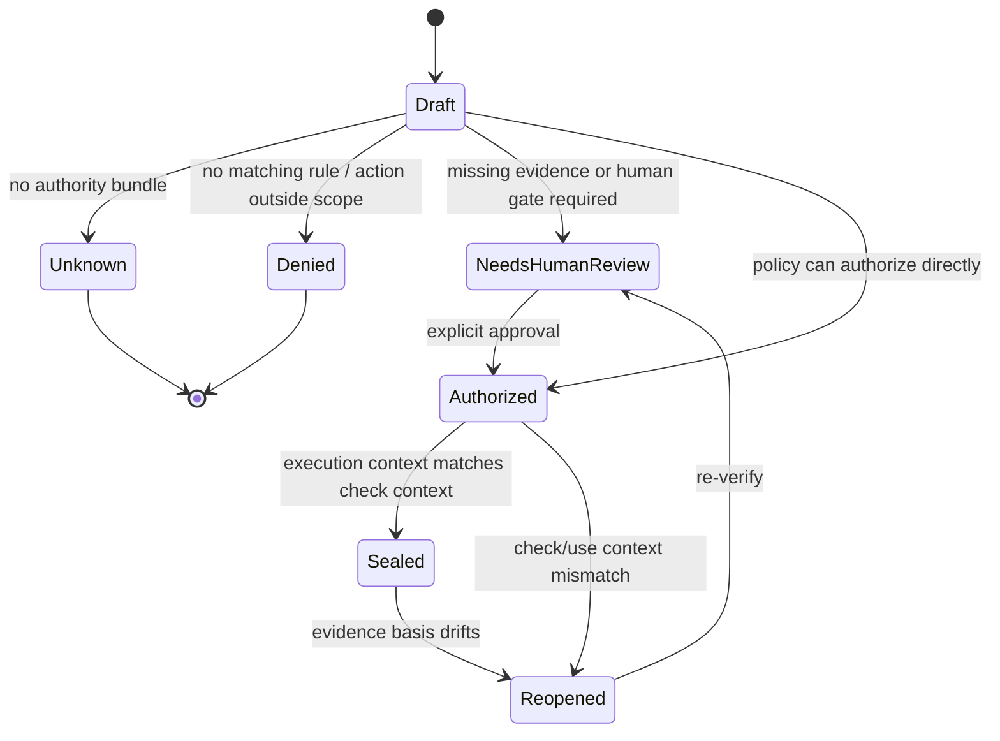

# Decision Receipt Lifecycle

A Decision Receipt is a lifecycle object, not a static audit note.



## Tenses

| Tense | Verb | Question |
|---|---|---|
| Before | `verify` | Is this action authorized against the current basis? |
| Before | `approve` | Who signs scoped authority into the object? |
| After | `seal` | Did execution use the same basis that was checked? |
| Later | `watch` | Has the evidence or authority basis drifted? |
| Replay | `replay` | Can an auditor reconstruct why the action was allowed? |

## Demo spine

```text
T0: certificate is valid
T1: action verifies and requires human review
T2: human approves scoped authority
T3: action seals because check-time equals use-time
T4: certificate is revoked
T5: watcher reopens the sealed receipt
```

One-line version:

```text
Same actor, same action, same workflow. Valid yesterday, blocked today, and the receipt explains why.
```
