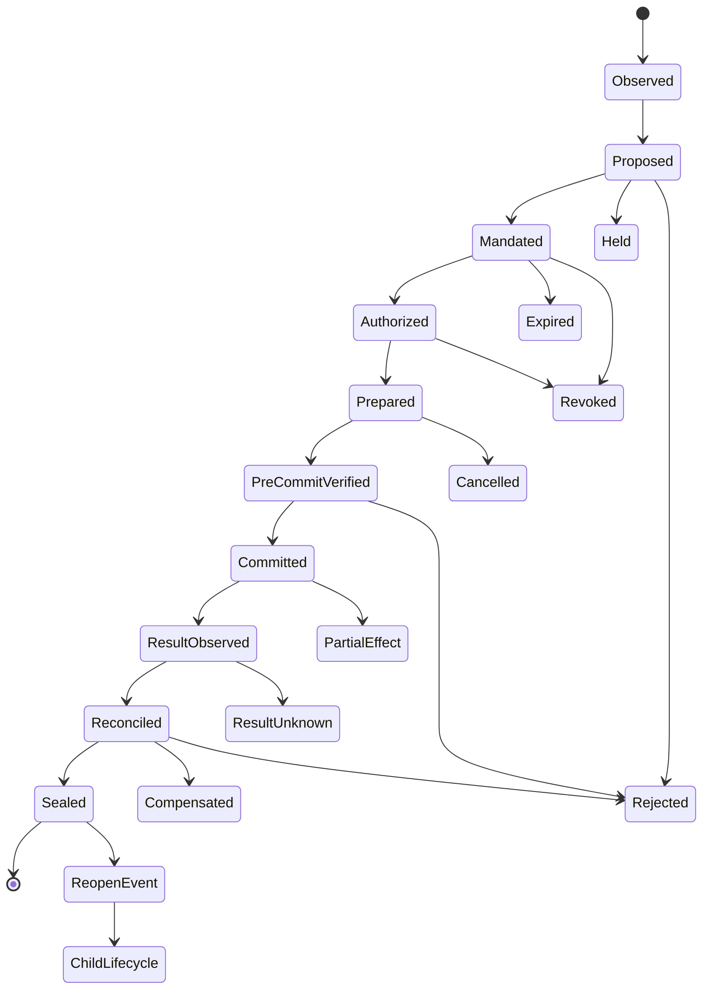

# Open Decision Receipt Lifecycle

The canonical ODR lifecycle connects institutional authority to verified execution. It separates preparation, the consequence boundary, result observation, reconciliation, and sealing so that authorization is not confused with execution or evidence.

A bounded authorization is single-use in the reference lifecycle. Successful consequence records when and by which execution hash it was consumed; reuse requires a new receipt lifecycle. Sealing is a Consequence Commit, not permission to promote the result into reusable knowledge.


```mermaid
stateDiagram-v2
    [*] --> Observed
    Observed --> Proposed
    Proposed --> Mandated
    Mandated --> Authorized
    Authorized --> Prepared
    Prepared --> PreCommitVerified
    PreCommitVerified --> Committed
    Committed --> ResultObserved
    ResultObserved --> Reconciled
    Reconciled --> Sealed
    Sealed --> [*]

    Proposed --> Held
    Proposed --> Rejected
    Mandated --> Expired
    Mandated --> Revoked
    Authorized --> Revoked
    Prepared --> Cancelled
    PreCommitVerified --> Rejected
    Committed --> PartialEffect
    ResultObserved --> ResultUnknown
    Reconciled --> Compensated
    Reconciled --> Rejected
    Sealed --> ReopenEvent
    ReopenEvent --> ChildLifecycle
```

## Canonical states

| State | Meaning |
|---|---|
| `Observed` | A need, risk, or signal is captured. Observation grants no authority. |
| `Proposed` | A bounded route or action is described. Proposal grants no authority. |
| `Mandated` | A named authority establishes purpose, scope, risk ceiling, conditions, and evidence obligations. |
| `Authorized` | Current policy and approval state permit a concrete actor to prepare one bounded attempt. |
| `Prepared` | Exact actor, action, target, parameters, context, and required capability are bound for evaluation. |
| `PreCommitVerified` | The prepared action passes current authority, policy, delegation, context, and revocation checks before consequence. |
| `Committed` | The admitted action crosses the consequence boundary. |
| `ResultObserved` | Resulting state and available execution evidence are captured. |
| `Reconciled` | Authorization, attempted and committed action, observed result, obligations, and evidence coverage are compared. |
| `Sealed` | An immutable Decision Receipt is created for the reconciled lifecycle. |

## Operational aliases

These terms may appear in implementations without defining another canonical lifecycle:

- `Claimed` is an operational substate of `Prepared`.
- `Executed` spans `Committed` and `ResultObserved`; attempted action, consequence crossing, and observed result remain distinct.
- `Submitted` is an evidence-submission event within `ResultObserved`.
- `Verified` is a verdict produced by `Reconciled`.
- `Watch` is a post-seal monitoring operation, not a lifecycle state.

## Post-seal drift

A sealed receipt is immutable. `watch` evaluates its referenced evidence and authority basis over time. A dispute, material drift, new evidence, defect, or remediation need creates an append-only `ReopenEvent` that references the sealed parent receipt. Re-evaluation or re-execution occurs in a linked `ChildLifecycle` with a `parent_receipt_id`; it does not mutate the sealed receipt.

```text
Sealed parent receipt
→ watch detects material change
→ append ReopenEvent(parent_receipt_id)
→ create ChildLifecycle(parent_receipt_id)
→ re-establish authority before any new action
```

## Interruption and closure outcomes

`Held`, `Rejected`, `Expired`, `Revoked`, `Cancelled`, `PartialEffect`, `Compensated`, `ResultUnknown`, `Remediated`, `Superseded`, and `ClosedWithException` are explicit outcomes. Revocation during prepared or committed work requires best-effort stop, result observation, partial-effect reconciliation, and compensation or named-human escalation.

## Tenses

| Tense | Operation | Question |
|---|---|---|
| Before | `verify` | Is this exact prepared action authorized against the current basis? |
| Before | `approve` | Who binds scoped authority into the mandate or approval object? |
| Commit | `execute` | What exact action crossed the consequence boundary? |
| After | `reconcile` | Did observed execution remain within authority and satisfy its obligations? |
| After | `seal` | Can the reconciled evidence be sealed without mutating prior history? |
| Later | `watch` | Has the evidence or authority basis materially changed? |
| Replay | `replay` | Can an auditor reconstruct why the action was allowed, refused, or reopened? |

## Current reference-implementation profile

The Python reference implementation exposes a narrower runtime vocabulary: `draft`, `unknown`, `denied`, `escalated`, `needs_human_review`, `authorized`, `sealed`, and `revoked`. Those are implementation statuses, not a second canonical lifecycle.

Post-seal drift preserves the sealed parent, appends a `ReopenEvent`, and creates a linked child receipt in `needs_human_review`. Seal-time check/use drift occurs before an immutable receipt exists and therefore returns the same attempt to `needs_human_review` rather than creating a post-seal reopen event.

## Demo spine

```text
T0: authority and evidence basis are current
T1: exact action is prepared
T2: pre-commit verification allows, refuses, or routes to review
T3: allowed action commits and its result is observed
T4: independent reconciliation seals the receipt
T5: referenced basis changes
T6: watcher appends a ReopenEvent and creates a linked child lifecycle
```

One-line version:

```text
Same actor, same action, same workflow. Valid yesterday, blocked today, with an immutable parent receipt and a linked explanation of what changed.
```

For a producer-to-consumer sequence diagram and a replayable high-risk credit example, see [`case-study-loan-denial.md`](./case-study-loan-denial.md).
